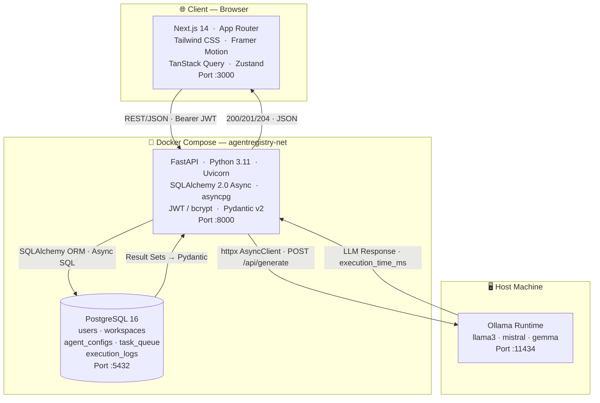

<div align="center">

# ⬡ AgentRegistry

### Local Multi-Agent Orchestrator for Open-Source LLMs

*Design, deploy, and monitor local AI agents — entirely on your own hardware.*

<br/>

[](https://fastapi.tiangolo.com)
[](https://nextjs.org)
[](https://postgresql.org)
[](https://python.org)
[](https://typescriptlang.org)
[](https://docker.com)
[](#)

<br/>

[](https://docs.sqlalchemy.org)
[](https://ollama.ai)
[](https://tailwindcss.com)
[](https://jwt.io)
[](https://docs.pydantic.dev)
[](LICENSE)

<br/>

> **AgentRegistry** is a production-grade, full-stack web application that lets you create,
> configure, and orchestrate multiple local LLM agents powered by [Ollama](https://ollama.ai).
> Each agent is backed by a normalized PostgreSQL schema, protected by JWT role-based authentication,
> and surfaced through a premium dark-mode glassmorphism dashboard.

<br/>


</div>

---

## ✦ System Architecture



---

## ✦ Feature Highlights

### 🔐 JWT Role-Based Authentication
Full stateless authentication using signed `HS256` JSON Web Tokens. Supports two roles — **Admin** and **Standard** — with route-level enforcement via FastAPI dependency injection. Tokens are stored in secure HTTP cookies and synchronized to a Zustand client store.

### 🗃️ Normalized Relational Data Layer (5 Tables)
A fully normalized PostgreSQL schema featuring Primary Keys, Foreign Keys with `ON DELETE CASCADE`, `NOT NULL` constraints, `UNIQUE` constraints, and a `CHECK` constraint on agent temperature — all defined declaratively via **SQLAlchemy 2.0 ORM** and versioned with **Alembic** migrations.

```
users ──< workspaces ──< agent_configs ──< task_queue ──── execution_logs
  PK          PK/FK          PK/FK             PK/FK           PK/FK(UNIQUE)
```

### 📊 Relational Analytics Engine — Triple-Table JOIN
A dedicated analytics endpoint executes a **3-table INNER JOIN** across `agent_configs`, `task_queue`, and `execution_logs`, computing `AVG()`, `MIN()`, `MAX()`, and conditional `COUNT()` aggregations — grouped by model name. Results are rendered in a **sortable, filterable table** with animated progress bars and a **Recharts bar chart**.

### 🤖 Full CRUD Agent Management
Complete **INSERT / SELECT / UPDATE / DELETE** lifecycle for agent configurations:
- Create agents with model selection, system prompt, and temperature tuning
- List agents dynamically per workspace with paginated queries
- Patch agent system prompts with PATCH semantics (partial update)
- Cascade-delete workspaces, removing all agents, tasks, and logs

### ⚡ Real-Time Task Execution via Ollama
A dedicated **Task Runner** submits prompts to local LLMs through the Ollama API (`POST /api/generate`). Each execution writes an atomic `TaskQueue → ExecutionLog` record pair with wall-clock timing in milliseconds, a status state machine (`PENDING → RUNNING → COMPLETED/FAILED`), and structured JSON logging.

### 🔍 Filtered Search & Sortable Reports
- Dashboard: free-text search across `model_name` and `system_prompt`
- Analytics: filter by model name, workspace scope, and health status (healthy ≥ 80% success rate)
- Sortable table columns with ASC/DESC toggle on all numeric metrics

### 🎨 Premium Glassmorphism UI
Dark-mode-only interface built with custom Tailwind CSS extensions:
- `backdrop-blur-2xl` glass panels with `bg-white/5` surfaces
- Animated floating orb scene background (CSS keyframe animation)
- Framer Motion page transitions, card animations, and running-state scan lines
- Skeleton loaders, animated progress bars, and a typing indicator terminal

### 🐳 Fully Containerised Deployment
Three-service Docker Compose stack with health checks, non-root users, resource limits, and a two-stage `entrypoint.sh` that runs Alembic migrations before starting Uvicorn — ensuring the database is always in sync on every deploy.

---

## ✦ Tech Stack

| Layer | Technology | Version | Purpose |
|---|---|---|---|
| **Frontend** | Next.js (App Router) | 14.2 | SSR, routing, server components |
| **Styling** | Tailwind CSS | 3.4 | Utility-first glassmorphism design |
| **Animation** | Framer Motion | 11 | Page transitions, card animations |
| **State** | TanStack Query + Zustand | v5 + v4 | Server state, auth state |
| **Forms** | React Hook Form + Zod | 7 + 3 | Validation, form management |
| **Backend** | FastAPI + Uvicorn | 0.111 | Async REST API, ASGI server |
| **ORM** | SQLAlchemy 2.0 Async | 2.0.30 | Type-safe async database access |
| **DB Driver** | asyncpg | 0.29 | High-performance PostgreSQL driver |
| **Migrations** | Alembic | 1.13 | Schema version control |
| **Database** | PostgreSQL | 16 | Relational persistence |
| **Auth** | python-jose + passlib | 3.3 + 1.7 | JWT signing, bcrypt hashing |
| **HTTP Client** | httpx | 0.27 | Async Ollama API calls |
| **Validation** | Pydantic v2 | 2.7 | Request/response schemas |
| **LLM Runtime** | Ollama | Latest | Local model inference |
| **Charts** | Recharts | 2.12 | Analytics visualisation |
| **Container** | Docker + Compose | Latest | Production deployment |

---

## ✦ Prerequisites

- [Docker Desktop](https://www.docker.com/products/docker-desktop/) (or Docker Engine + Compose plugin)
- [Ollama](https://ollama.ai) installed and running on your host machine
- `openssl` available in your terminal (for key generation)

---

## ✦ Quick Start — Docker Compose

```bash
# 1. Clone the repository
git clone https://github.com/yourusername/agentregistry.git
cd agentregistry

# 2. Start Ollama on your host and pull a model
ollama serve
ollama pull llama3

# 3. Configure environment variables
cp .env.example .env

# 4. Generate a cryptographically secure JWT secret key
echo "SECRET_KEY=$(openssl rand -hex 32)" >> .env

# 5. Set a strong database password in .env
#    POSTGRES_PASSWORD=your_strong_password_here

# 6. Build and launch the full stack (PostgreSQL + FastAPI + Next.js)
docker compose up --build -d

# 7. Watch the backend start up (runs Alembic migrations first)
docker compose logs -f backend

# 8. Access the application
#    Dashboard  → http://localhost:3000
#    API Docs   → http://localhost:8000/api/docs
#    ReDoc      → http://localhost:8000/api/redoc
```

> **First run:** Create your account at `http://localhost:3000/login` → Register tab.  
> **Admin account:** Set `"role": "admin"` in the register form or directly in the DB.

---

## ✦ Manual Local Development Setup

### Backend

```bash
cd backend

# Create and activate a virtual environment
python -m venv .venv
source .venv/bin/activate          # Windows: .venv\Scripts\activate

# Install dependencies
pip install -r requirements.txt

# Copy and configure environment
cp .env.example .env
# Edit .env: set DATABASE_URL, SECRET_KEY

# Run Alembic migrations
alembic upgrade head

# Generate a new migration after model changes
alembic revision --autogenerate -m "describe your change"

# Start development server (hot reload)
uvicorn app.main:app --reload --port 8000
```

### Frontend

```bash
cd frontend

# Install dependencies
npm ci

# Copy and configure environment
cp .env.example .env.local
# NEXT_PUBLIC_API_URL=http://localhost:8000

# Start development server
npm run dev

# Type-check without building
npm run type-check
```

---

## ✦ API Reference Summary

| Method   | Endpoint                        | Auth | Description                               |
|----------|---------------------------------|------|-------------------------------------------|
| `POST`   | `/api/v1/auth/register`         | ❌   | Create user account                       |
| `POST`   | `/api/v1/auth/token`            | ❌   | Login → JWT Bearer token                  |
| `GET`    | `/api/v1/auth/me`               | ✅   | Current user profile                      |
| `POST`   | `/api/v1/workspaces/`           | ✅   | Create workspace                          |
| `GET`    | `/api/v1/workspaces/`           | ✅   | List workspaces (paginated)               |
| `DELETE` | `/api/v1/workspaces/{id}`       | ✅   | Cascade-delete workspace + all children   |
| `POST`   | `/api/v1/agents/`               | ✅   | **INSERT** — Create agent config          |
| `GET`    | `/api/v1/agents/`               | ✅   | **SELECT** — List agents by workspace     |
| `PATCH`  | `/api/v1/agents/{id}`           | ✅   | **UPDATE** — Partial update agent config  |
| `DELETE` | `/api/v1/agents/{id}`           | ✅   | **DELETE** — Remove agent + tasks + logs  |
| `POST`   | `/api/v1/agents/{id}/run`       | ✅   | Execute prompt via Ollama                 |
| `GET`    | `/api/v1/analytics/model-report`| ✅   | **3-Table JOIN** — Performance analytics  |

Full interactive documentation available at `http://localhost:8000/api/docs`.

---

## ✦ Project Structure

```
agentregistry/
│
├── backend/                        # FastAPI Python application
│   ├── app/
│   │   ├── main.py                 # App factory + middleware + lifespan
│   │   ├── config.py               # Pydantic-settings (reads .env)
│   │   ├── db/
│   │   │   ├── base.py             # DeclarativeBase + naming conventions
│   │   │   └── session.py          # Async engine + session factory
│   │   ├── models/                 # SQLAlchemy 2.0 ORM models (5 tables)
│   │   │   ├── user.py
│   │   │   ├── workspace.py
│   │   │   ├── agent_config.py
│   │   │   ├── task_queue.py
│   │   │   └── execution_log.py
│   │   ├── schemas/                # Pydantic v2 request/response schemas
│   │   ├── services/               # Business logic layer (no SQL in routers)
│   │   │   ├── agent_service.py    # CRUD + Ollama integration
│   │   │   ├── workspace_service.py
│   │   │   ├── task_service.py
│   │   │   └── analytics_service.py  # 3-table JOIN query
│   │   ├── api/
│   │   │   ├── deps.py             # get_db, get_current_user, require_admin
│   │   │   └── v1/endpoints/       # Thin HTTP handlers only
│   │   └── core/
│   │       ├── security.py         # JWT + bcrypt
│   │       ├── exceptions.py       # Custom handlers (404, 401, 403, 409, 503)
│   │       └── logging.py          # Structured JSON logging
│   ├── alembic/                    # Database migration versions
│   ├── Dockerfile
│   └── entrypoint.sh               # Migration runner + Uvicorn launcher
│
├── frontend/                       # Next.js 14 App Router application
│   ├── app/
│   │   ├── layout.tsx
│   │   ├── (auth)/login/page.tsx   # Glassmorphic auth page
│   │   ├── dashboard/page.tsx      # Command Center (agent grid)
│   │   ├── analytics/page.tsx      # JOIN report + charts + filters
│   │   └── tasks/page.tsx          # LLM Task Runner terminal
│   ├── components/
│   │   ├── ui/                     # GlassCard, Badge, Button, Input, Modal, Skeleton
│   │   ├── layout/                 # SceneBackground, Sidebar, DashboardLayout
│   │   └── dashboard/              # AgentCard, AddAgentModal, StatsRow
│   ├── hooks/                      # TanStack Query wrappers
│   ├── lib/
│   │   ├── api-client.ts           # Axios + Bearer interceptor
│   │   ├── api/                    # Typed API call functions
│   │   └── schemas.ts              # Zod validation schemas
│   ├── store/authStore.ts          # Zustand auth state
│   ├── middleware.ts               # Route protection
│   └── Dockerfile
│
├── docker-compose.yml              # Full stack orchestration
├── .env.example                    # Environment variable template
└── README.md
```

---

## ✦ Database Schema

```sql
-- Auto-managed by Alembic. Reference only.

CREATE TABLE users (
    id            SERIAL PRIMARY KEY,
    username      VARCHAR(64)  NOT NULL UNIQUE,
    password_hash VARCHAR(255) NOT NULL,
    role          user_role_enum NOT NULL DEFAULT 'standard',
    created_at    TIMESTAMPTZ  NOT NULL DEFAULT NOW()
);

CREATE TABLE workspaces (
    id          SERIAL PRIMARY KEY,
    user_id     INT NOT NULL REFERENCES users(id) ON DELETE CASCADE,
    name        VARCHAR(128) NOT NULL,
    description TEXT,
    UNIQUE (user_id, name)
);

CREATE TABLE agent_configs (
    id            SERIAL PRIMARY KEY,
    workspace_id  INT NOT NULL REFERENCES workspaces(id) ON DELETE CASCADE,
    model_name    VARCHAR(128) NOT NULL,
    system_prompt TEXT NOT NULL,
    temperature   FLOAT NOT NULL CHECK (temperature >= 0.0 AND temperature <= 2.0)
);

CREATE TABLE task_queue (
    id          SERIAL PRIMARY KEY,
    agent_id    INT NOT NULL REFERENCES agent_configs(id) ON DELETE CASCADE,
    prompt_text TEXT NOT NULL,
    status      task_status_enum NOT NULL DEFAULT 'pending',
    created_at  TIMESTAMPTZ NOT NULL DEFAULT NOW()
);

CREATE TABLE execution_logs (
    id                SERIAL PRIMARY KEY,
    task_id           INT NOT NULL UNIQUE REFERENCES task_queue(id) ON DELETE CASCADE,
    response_text     TEXT NOT NULL,
    execution_time_ms INT NOT NULL,
    timestamp         TIMESTAMPTZ NOT NULL DEFAULT NOW()
);
```

---

## ✦ Docker Management

```bash
# Start all services in detached mode
docker compose up -d

# Rebuild after code changes
docker compose up --build -d

# View real-time logs
docker compose logs -f
docker compose logs -f backend     # backend only
docker compose logs -f frontend    # frontend only

# Run Alembic migration manually
docker compose exec backend alembic upgrade head

# Generate a new migration
docker compose exec backend alembic revision --autogenerate -m "add_column_x"

# Connect to PostgreSQL directly
docker compose exec postgres psql -U agentregistry -d agentregistry

# Stop and remove containers (keep DB volume)
docker compose down

# Full reset — WARNING: destroys all data
docker compose down -v
```

---

## ✦ Environment Variables Reference

| Variable                     | Required | Default    | Description                                   |
|------------------------------|----------|------------|-----------------------------------------------|
| `POSTGRES_USER`              | ✅       | —          | PostgreSQL username                           |
| `POSTGRES_PASSWORD`          | ✅       | —          | PostgreSQL password                           |
| `POSTGRES_DB`                | ✅       | —          | PostgreSQL database name                      |
| `SECRET_KEY`                 | ✅       | —          | 32-byte hex secret for JWT signing            |
| `ALGORITHM`                  |          | `HS256`    | JWT signing algorithm                         |
| `ACCESS_TOKEN_EXPIRE_MINUTES`|          | `60`       | JWT expiry window                             |
| `NEXT_PUBLIC_API_URL`        | ✅       | —          | Public URL of the FastAPI backend             |
| `UVICORN_WORKERS`            |          | `2`        | Uvicorn worker process count                  |
| `DEBUG`                      |          | `false`    | Enable SQLAlchemy query logging               |
| `LOG_LEVEL`                  |          | `info`     | Uvicorn log level                             |

---

## ✦ Academic Compliance Summary

This project was designed to satisfy a strict academic evaluation. The table below maps every mandatory requirement to its implementation:

| Requirement | Implementation | Key File(s) |
|---|---|---|
| 5 normalized tables with PKs | ✅ All 5 models with `primary_key=True` | `app/models/` |
| Foreign Keys + CASCADE | ✅ All FKs with `ondelete="CASCADE"` | All model files |
| NOT NULL + UNIQUE + CHECK | ✅ All constraints declared in ORM | `agent_config.py`, `workspace.py` |
| INSERT operation | ✅ `POST /agents/` | `agent_service.create_agent()` |
| SELECT operation | ✅ `GET /agents/` + `GET /workspaces/` | `list_agents()`, `list_workspaces()` |
| UPDATE operation | ✅ `PATCH /agents/{id}` | `agent_service.update_agent()` |
| DELETE with cascade | ✅ `DELETE /workspaces/{id}` | `workspace_service.delete_workspace()` |
| 3-table JOIN + aggregations | ✅ `GET /analytics/model-report` | `analytics_service.py` |
| Filtered search | ✅ Dashboard search + Analytics filters | `dashboard/page.tsx`, `analytics/page.tsx` |
| Forms with validation | ✅ React Hook Form + Zod | `AddAgentModal.tsx`, `login/page.tsx` |
| JWT Auth + RBAC | ✅ HS256 JWT + Admin/Standard roles | `core/security.py`, `api/deps.py` |
| Glassmorphism UI | ✅ Custom Tailwind config + Framer Motion | `tailwind.config.ts`, `GlassCard.tsx` |
| Docker deployment | ✅ 3-service Compose with health checks | `docker-compose.yml` |
| Local LLM integration | ✅ httpx → Ollama `/api/generate` | `agent_service.execute_task_via_ollama()` |

---

## ✦ Contributing

1. Fork the repository
2. Create a feature branch: `git checkout -b feature/your-feature-name`
3. Commit with conventional commits: `git commit -m "feat: add workspace sharing"`
4. Push and open a Pull Request

Please run `npm run type-check` (frontend) and ensure all Pydantic schemas are updated for any model changes before submitting.

---

## ✦ License

Distributed under the **MIT License**. See [`LICENSE`](LICENSE) for details.

---

<div align="center">

Built with precision as an enterprise-grade academic project.  
*FastAPI · Next.js · PostgreSQL · Ollama · Docker*

</div>